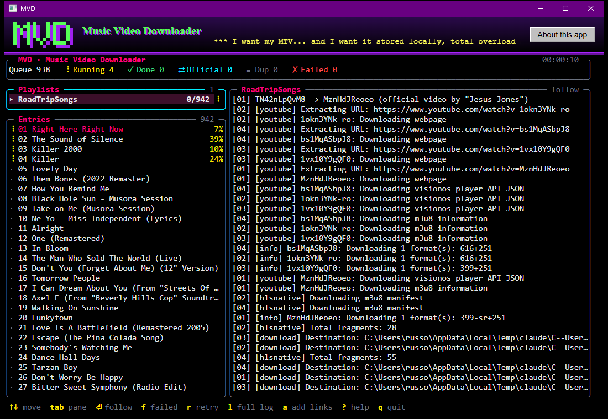
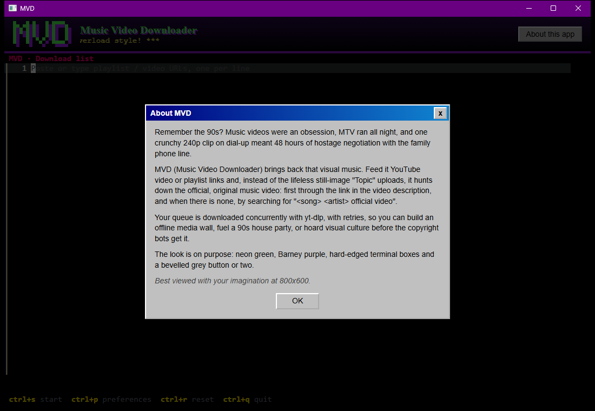
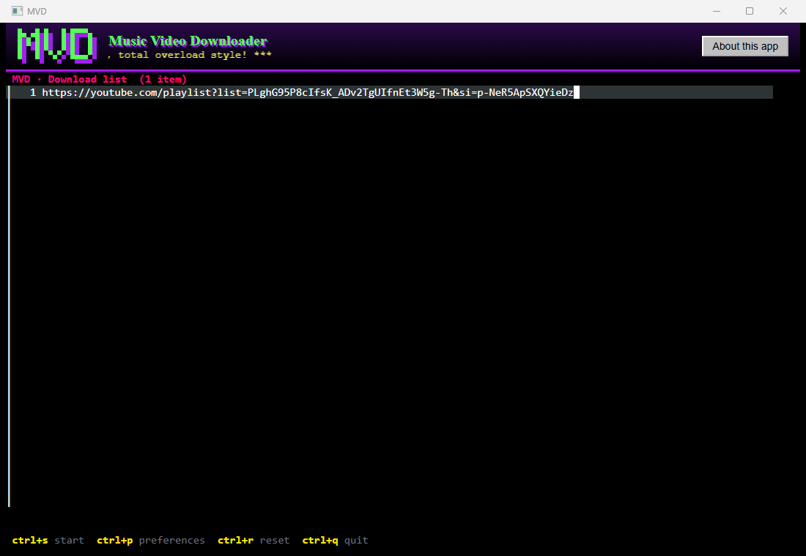
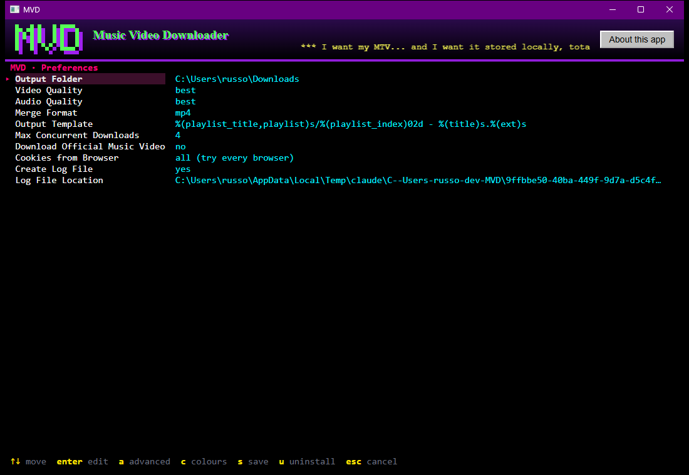
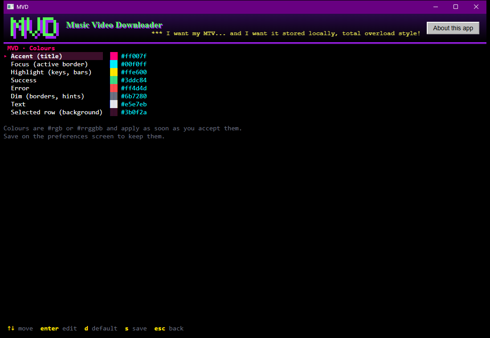
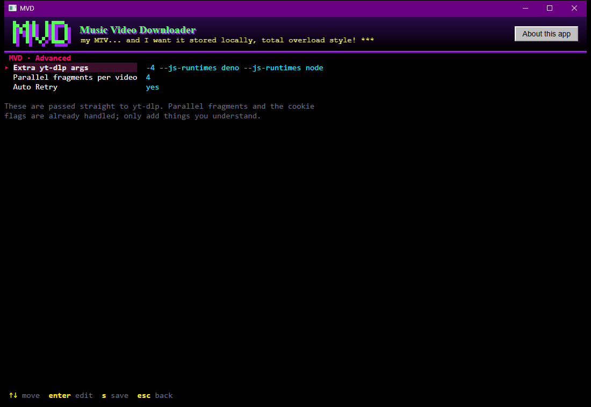

<p align="center">
  
</p>

# Music Video Downloader (Go + yt-dlp) - the boring description...

A lightweight, zero-setup, concurrent Go application with two front ends, a desktop app with a window of its own (`mvd`) and a terminal app (`mvd-tui`). The terminal app has interactive screens: paste a list of playlists/videos, tune settings in a preferences screen, and watch a live download dashboard. It self-diagnoses and installs missing dependencies, borrows your browser's YouTube cookies automatically, downloads in parallel, and keeps its config and list in your OS preferences folder.

---

## ⚡ Features & Self-Installation

* **Auto-Dependency Installation**: On launch, the app checks for `yt-dlp`, `ffmpeg`, and a JavaScript engine (`deno`). If any dependency is missing, it automatically downloads and extracts pre-built binaries for your operating system before running: into the app-data folder's `bin` for the tray app, into `./bin/` for the terminal app (see below).
* **Cross-Platform**: Works out of the box on **Windows**, **macOS** (Intel & Apple Silicon), and **Linux**.
* **Parallel Downloads**: Downloads multiple playlists concurrently using Go goroutines and a worker semaphore pool.
* **YouTube 403 Bypass**: Pre-configured with IPv4 enforcement and JS runtime options to prevent HTTP 403 Forbidden errors.
* **Official Music Video Mode**: Optionally swaps auto-generated "`<Artist> - Topic`" audio tracks for the official music video that YouTube links from the description's **Music** card.
* **Automatic browser cookies**: Finds a browser you're signed into YouTube with and uses its cookies to clear bot checks and `429` errors, with no configuration.
* **Spotify and Apple Music playlists**: Paste a public playlist link; the app reads its songs without any login and finds each one on YouTube, the official video first (see below).
* **Song lists from anywhere**: A text file of `Artist - Title` lines, or a CSV with title and artist columns, is handled like a playlist (see below).
* **Your colours**: The interface colours are configurable, in the app or in `config.conf`.
* **Auto-retry**: Retries one-off failures at once and rate-limited ones in a sweep after the backlog finishes; never retries permanently gone videos.
* **Full Screen Interface**: A fixed terminal UI shows every playlist and entry with its state, live progress of the running downloads, global counters (queue, running, done, official, duplicates, failed) and the yt-dlp output of whatever you select. Failed entries can be retried from the screen. Pipes and CI get a plain log instead.

---

## 🌐 The desktop app (`mvd`)

`apps/mvd` builds the program `mvd`, the main app: a window of its own showing the terminal interface (the same screens as the terminal app, `mvd-tui`, described after this section), on the same engine. It is a normal program: closing the window quits it (it asks first when downloads are still running). The window's page and its connection are Wails' own (no local server, no port), so nothing listens on the network. Starting it again raises the window that is already open instead of opening a second one. Paste links into it at any time, including while it is downloading (`a`).

```powershell
npx nx run mvd:build          # builds the React page, embeds it, builds the binary
./dist/apps/mvd/mvd           # flag: -uninstall
npx nx run mvd:start          # development: builds the page, then runs the app
```

<p align="center">
  
</p>

**Tools and updates.** The app keeps its own copy of yt-dlp and ffmpeg in a `bin` folder inside the app-data folder (`%AppData%\mvd\bin` on Windows, `~/Library/Application Support/mvd/bin` on macOS, `~/.config/mvd/bin` on Linux), whatever is on your `PATH`, so it can keep them current without touching anything you installed yourself. A folder you can always write to, so no administrator rights are involved, and the same place on every start. deno is added only if you have neither deno nor node.

The first run downloads them from their official GitHub releases (on Windows about 310 MB: yt-dlp 17 MB, ffmpeg 200 MB, deno 93 MB), checks each against the SHA-256 that GitHub publishes for it, and says what it is doing in a notification. After that it looks for newer versions in the background each time it starts, which never holds up the page or a download, and again when a download fails (at most every ten minutes), because an out-of-date yt-dlp is the usual reason a video that worked yesterday does not today. If it replaced something after a failure it queues the failed downloads again and tells you. A new yt-dlp replaces the old one as soon as it is published. ffmpeg is replaced only by a build at least 30 days newer, because its builds are republished daily and are 200 MB. The old program is moved aside rather than deleted, so an update works even while a download is using it, and a check or download that fails changes nothing.

Limits: ffmpeg is kept current on Windows only (the project that publishes the builds has no macOS build and ships Linux ones in a format this does not unpack yet, so those fetch a pinned 4.4.1 once). deno is fetched once and never updated. The terminal app keeps using `./bin` and the tools on your `PATH`, and does not update them.

**Where it lives.** The first time a release of the desktop app is started from somewhere else (your Downloads folder, say), it asks once whether to move itself to the place your system keeps programs. Yes copies it there, adds it to the menu, starts the copy and removes the old file. No leaves it where it is, and it never asks again. It does not ask when started with `-no-window` (a terminal or script), from a development build, or from the installed place.

- **Windows:** `%LocalAppData%\Programs\MVD` with a Start menu shortcut, which needs no administrator rights. If the app was started as an administrator it offers a choice: *For everyone* (`C:\Program Files\MVD`, with a shortcut for every account) or *Just for me*. The app never asks Windows for administrator rights itself: an unsigned program that can start an administrator step is removed by Windows' antivirus (`Trojan:Win32/Bearfoos.A!ml`), so to install for everyone, right-click the app and choose Run as administrator. A signed build could offer that with one click.
- **macOS:** the release has an `mvd_<version>_macos_universal.dmg`. Open it and drag **MVD** onto the **Applications** link in the same window. The app is not notarized by Apple, so the first launch needs a right-click on MVD and **Open**; on newer macOS, if it still refuses, open System Settings, Privacy & Security and choose **Open Anyway**. An MVD started from anywhere else offers to move itself to `/Applications/MVD.app` (everyone) or `~/Applications/MVD.app` (just you).
- **Linux:** `~/.local/bin/mvd` with an entry in the applications menu.

**Windows says it is a virus?** Windows Defender has flagged an MVD download as `Trojan:Win32/Bearfoos.A!ml`. The `!ml` ending means a machine-learning guess, not a known signature, and MVD is not code-signed, so this looks like a false positive, but that is for you to judge: the source is here, every release is built by the public CI of this repository, and you can build it yourself (`npx nx run mvd:build`). If Defender quarantines it, you can restore it and report it to Microsoft as a false positive at <https://www.microsoft.com/en-us/wdsi/filesubmission>.

The macOS and Linux paths, and the `.dmg`, are covered by unit tests and CI only; they have not been run on a real machine.

**Uninstalling.** Settings has a *Remove MVD* button, and `mvd -uninstall` does the same from a terminal. On Windows the app is also listed in Settings > Apps, whose Uninstall button runs `-uninstall`; if MVD is running, that one is asked to remove itself, which closes it. Whichever way it starts, MVD first shows a window on your computer listing exactly what it will remove, and nothing is removed unless you say yes there. You choose whether your preferences (settings, list and the tools MVD downloaded) go too. Your downloaded videos and their folder are never touched.

- **Windows:** the program, its install folder when that is MVD's own (`%LocalAppData%\Programs\MVD` or `C:\Program Files\MVD`; a copy running from Downloads loses only the program), the Start menu shortcuts and the Settings > Apps entry. The running program cannot delete itself, so it is moved into the temporary folder, which Windows empties. Removing the system-wide copy needs MVD to be started as an administrator; it never asks for those rights itself.
- **macOS:** the `MVD.app` it runs from, or the one in `/Applications` or `~/Applications`. If that is refused, MVD says so and you drag it to the Trash.
- **Linux:** `~/.local/bin/mvd` and the menu entry.

Starting it a second time opens the running one instead. The server only answers to `localhost`: a request is refused unless its Host is a loopback name, any Origin is a loopback page, and anything that changes state is `application/json`, so a web page on another site cannot read your queue or add to it.

**The terminal window.** Starting the app opens the terminal interface in a window of its own: the same screens as `apps/mvd-tui` (download list, preferences, downloads), carried by [TReactUI](https://github.com/meta-tui/treactui) over the window's own events (`apps/mvd/terminalui`, with the page from `apps/mvd-web`). The window is drawn by the system's web view through [Wails](https://wails.io) v2, so no browser has to be installed: WebView2 on Windows (part of Windows 11 and of current Windows 10; Wails offers to install it where it is missing), WKWebView on macOS, and WebKitGTK 4.1 on Linux (`libwebkit2gtk-4.1`, found in the package manager of current distributions; the terminal app `mvd-tui` needs nothing of the kind). It is one window: closing it quits the app, after asking when downloads are running, and starting the app again raises the open window. It has the mouse (click a key hint or a row, wheel to scroll) and paste. The web view's own shortcuts are kept from firing while the window is focused, so Ctrl+P opens the preferences instead of the print dialog. It reads and writes the same `config.conf` and `list.txt` as the terminal app. Keys: `a` adds links to a running download, and on the preferences `u` uninstalls and the folder settings open the system's own folder chooser.

The page is `apps/mvd-web` (React: the 90s header with its pixel-art logo and the *About this app* window (pictured below), above `<TTY>` from [`@treactui/tty`](https://www.npmjs.com/package/@treactui/tty) filling the rest); `apps/mvd/appwindow` shows it in the Wails window: Wails serves the built page itself (embedded from `appwindow/web`, which the `stage-web` target fills) and the page talks to the Go program through Wails events, with no server, port or WebSocket (`createWailsSocket` on the page, `ttygo.BindShared` in Go); the terminal interface is `apps/mvd/terminalui`, which builds the app model of `libs/mvd-core/tui` as a program shared by every page load. The page works only inside the window. `mvd -uninstall` asks and removes in its own process; a copy that is running keeps running until it is closed, since removing the program just moves it aside. The old flags `-addr`, `-no-window`, `-no-browser` and `-no-tray` are still accepted and do nothing. Single instance is Wails' own: a second start finds the first and raises its window. The app needs a C toolchain to build on macOS and Linux (the web views are native), which is why it is built on a runner of each OS; on Linux the build needs `libgtk-3-dev` and `libwebkit2gtk-4.1-dev` and the tags `production,webkit2_41` (set in `apps/mvd/project.json`); Windows builds without a C compiler. The Windows release is a windowed program, so no console window opens next to the window; a start-up error is shown in a message box instead, and when it is started from a terminal it also prints there. That comes from `-H=windowsgui` in the `build-native` target of `apps/mvd/project.json`, which is edited by hand (mnci cannot pass the flag yet), and from `libs/mvd-core/procwindow`, which keeps yt-dlp and the folder chooser from opening console windows of their own. Plain `nx run mvd:build` and `go run` stay console builds, so you see the logs.

<p align="center">
  
</p>

## 🚀 Quick Start (terminal app)

Build and run; on first launch it creates a default config in your preferences folder and opens the **preferences** screen:

```powershell
go build -o mvd-tui.exe ./apps/mvd-tui
.\mvd-tui.exe
```

Then: paste your playlist/video URLs on the **list** screen (one per line), press `Ctrl+S` to start, and the **download** dashboard takes over.

<p align="center">
  
</p> Everything is kept in the app-data folder (see below) — there are no config files next to the binary.

For an unattended/headless run (pipes, CI, cron) it downloads the saved list with a plain log instead of the screens:

```powershell
.\mvd-tui.exe --no-tui
```

---

## 🖥️ The terminal app interface (`mvd-tui`)

```
╭─ MVD · Music Video Downloader ──────────────────────────────────────── 00:12:41 ─╮
│ Queue 82   ⠋ Running 3   ✓ Done 57   ⇄ Official 41   ≡ Dup 3   ✗ Failed 2        │
╰──────────────────────────────────────────────────────────────────────────────────╯
╭─ Playlists ───────────────── 3 ─╮╭─ 90s UK Dance Hits › 07 Stardust ──── follow ─╮
│▸ 90s UK Dance Hits    23/90  ⠋  ││[official] hRvrj_diWYQ -> 5dYAQEAyE1E          │
│  Ibiza Classics       44/44  ✓  ││[youtube] 5dYAQEAyE1E: Downloading webpage     │
│  Trance Anthems        0/61  ·  ││[info] Downloading format 137+251              │
╰─────────────────────────────────╯│[download] Destination: ...                    │
╭─ Entries ────────────────── 90 ─╮│                                               │
│✓ 01 You Don't Know Me        ⇄  ││                                               │
│✓ 02 Don't Call Me Baby       ⇄  ││                                               │
│✓ 03 Modjo - Lady                ││                                               │
│✗ 04 Bob Sinclar - I Feel   ERR  ││                                               │
│≡ 05 Bob Sinclar (Radio)    dup  ││                                               │
│⟲ 06 The Bucketheads       res.  ││                                               │
│⠋ 07 Stardust               34%  ││ ████████░░░░░░░░░░░  34.2% of 112.4MiB at ... │
│· 08 Daft Punk                   ││                                               │
╰─────────────────────────────────╯╰───────────────────────────────────────────────╯
 ↑↓ move  tab pane  ⏎ follow  f failed  r retry  l full log  ? help  q quit
```

* **Header**: global counters and elapsed time. `FINISHED` appears when the queue is empty.
* **Playlists**: one row per URL with `done/total`. The selected playlist drives the entries pane.
* **Entries**: every track of the selected playlist. Glyphs: `·` queued, `⟲` resolving the official video, `⠋` downloading, `⚙` merging, `✓` done, `≡` duplicate skipped, `✗` failed. The right hand tag shows `⇄` when the official video replaced the art track, the download percentage, `dup`, `res.`, `merge` or `ERR`.
* **Output**: the yt-dlp log of the selected entry with a progress bar, speed and ETA. Select a playlist to see its combined log.
* **Keys**: `↑ ↓` move, `tab` switch pane, `enter` toggle follow mode (the selection jumps to whatever starts downloading), `f` show failed entries only, `r` retry the selected failed entry (or every failed entry of the playlist when the playlists pane is focused), `l` full screen output, `?` help, `ctrl+l` redraw the screen, `q` quit.

The screen stays up when everything is finished so the counters and failures remain visible. Every line is also appended to `mvd.log` (see `log_file`).

Terminals narrower than 100 columns show only the lists; press `l` for the output. When stdout is not a terminal, or with `--no-tui` (or `MVD_NO_TUI=1`), the app prints a plain log instead and exits when done.

Emoji in playlist and video titles are not drawn, because terminals disagree on their width and one wrong guess shifts the whole layout. The interface uses Unicode box drawing and status glyphs, so use a terminal with a font that has them (Windows Terminal, iTerm2, GNOME Terminal, kitty, VS Code and most others are fine). A terminal that does not answer colour queries can add a five second pause at start-up; `--no-tui` avoids it.

Work goes through four stages, each with its own queue and workers, so a slow one does not hold the others back:

1. **List**: `list_workers` (default 4) playlists are read at the same time.
2. **Name**: `name_workers` (default 8) uploads are named at the same time, asking iTunes, Deezer and MusicBrainz for the artist and title. Each service is paced on its own (MusicBrainz allows one request a second) and is left alone for a minute if it refuses a request.
3. **Pick**: `pick_workers` (default 4) songs get their version picked at the same time: the official video, else the upload with the best picture and sound.
4. **Download**: `max_concurrent_downloads` is the number of videos in flight across all playlists. Each video also fetches `concurrent_fragments` fragments in parallel.

Downloads start as soon as the first song has been picked, while the rest are still being named. Files are numbered by playlist position, so the order they finish in does not matter.

## ⚙️ Configuration

Config and the download list live in your OS preferences folder, created on first run — nothing sits next to the binary:

| OS | Folder |
|---|---|
| Windows | `%AppData%\mvd\` |
| macOS | `~/Library/Application Support/mvd/` |
| Linux | `~/.config/mvd/` |

It holds `config.conf` (settings), `list.txt` (your URLs), `official-videos.json` (the official videos already found, so a second run asks nobody; delete it to search again) and `cookies.txt` (the exported browser cookies, private — keep it safe). You normally never touch these by hand; edit everything in the app. A legacy `setup.conf`/`downloads.conf` next to the binary is imported once on first run.

### Screens and keys

<p align="center">
  
  
  
</p>

- **List** — paste/type URLs, one per line. `Ctrl+S` start · `Ctrl+P` preferences · `Ctrl+R` reset · `Ctrl+Q`/`Esc` quit. (Ctrl here because Return makes a new line.)
- **Preferences** — `↑↓` move · `Enter` edit/toggle · `a` advanced · `c` colours · `s` save · `Esc` cancel. Booleans toggle on Enter; quality/merge/cookies open a radio selector; the output and log folders open a folder navigator (`↑↓` move, `→` open, `←` up, `n` new folder, `Enter` choose, `Esc` cancel).
- **Advanced** — raw extra yt-dlp args, parallel fragments and auto-retry. `s` save · `Esc` back.
- **Colours** — the eight interface colours, each with a swatch. `Enter` edit (`#rgb` or `#rrggbb`, applied as soon as you accept it) · `d` default · `s` save · `Esc` back. Save on the preferences screen to keep them.
- **Download** — the live dashboard (see above); `q` returns to the list.

> Keys are bare single letters where you aren't typing; `Ctrl` is used only on the list editor. A terminal can't receive the Cmd key on macOS, so `Ctrl` is used on every platform.

### `config.conf` keys (for reference)

`output_dir`, `video_quality` (best/2160p/1440p/1080p/720p/480p), `audio_quality` (best/high/medium/low), `raw_format` (raw `-f` override), `merge_output_format`, `output_template`, `max_concurrent_downloads`, `concurrent_fragments` (`off` to disable), `list_workers`, `name_workers`, `pick_workers`, `download_official_music_video`, `auto_retry`, `cookies_from_browser` (`all`/`off`/a browser name), `cookies_file`, `create_log_file`, `log_dir`, `extra_args`.

The interface colours are `color_accent`, `color_focus`, `color_highlight`, `color_success`, `color_error`, `color_dim`, `color_text` (text) and `color_selected` (background of the selected row), each a `#rgb` or `#rrggbb` value such as `color_accent=#ff007f`. A missing or invalid value keeps the default. You can also change them in the app: on the preferences press `c` for the colours screen, where each colour shows a swatch and applies as you accept it (`d` restores the default of the selected one). Edited in the file, they apply on the next start.

### Browser cookies

YouTube rate limits heavy use and answers with `Sign in to confirm you're not a bot` or `HTTP Error 429`. The way around it is to run as a signed-in user by borrowing a browser's cookies. **This is on by default and needs no configuration**: at start the app tries every installed browser and uses the first one with a live YouTube login, saving it to `cookies_file` (default `cookies.txt`, ignored by git, keep it private: it holds your session). Later runs reuse that file; delete it to refresh. Every yt-dlp run and the official video resolver use it.

To pin one browser, set its name; to turn cookies off, set `off`:

```ini
cookies_from_browser=firefox   # or: edge, chrome, brave, chromium, opera, vivaldi, firefox:default
```

You can also drop your own cookie file (exported with a browser extension) at `cookies_file`; an existing file is reused as-is.

**Caveat:** Chrome and Edge 127+ encrypt their cookies (App-Bound Encryption) and yt-dlp often cannot read them, even with the browser closed. **Firefox is the reliable source.** If auto mode finds nothing, sign in to YouTube in Firefox, or export a cookie file manually.

### Spotify and Apple Music playlists

Add a public Spotify (`https://open.spotify.com/playlist/...`, or `spotify:playlist:...`) or Apple Music (`https://music.apple.com/<country>/playlist/<name>/pl.<id>`) playlist link to the list like any other. The app reads the track list from the playlist's public web page, so there is no login and no API key, then looks each song up on YouTube and downloads it: the official video when there is one, else the best other upload (a lyric video, the audio, the artist's Topic upload) that carries the song title and the artist. Covers, live versions, remixes and karaoke are never picked. A song with no match fails with "no matching video found on YouTube" and the others carry on.

Limits: the playlist must be public, and the services' public pages may list only the first part of a very long playlist. Songs with several artists (`A, B` or `A & B`) match a video that names any of them.

### Auto-retry

Failed downloads are retried automatically (`auto_retry=on` by default). A one-off glitch is retried immediately; a rate-limited failure (`429`, bot check) is retried in a single sweep after the whole backlog finishes, once a cooldown lets the limit window reset; a permanent failure (private, removed, geo-blocked) is never retried. The header and summary show a **Retried** count. Set `auto_retry=off` to fail and move on instead.

### Song lists (any service)

When all you have is the artist and the title of each song, give the app a list. Press `Ctrl+O` on the download list, paste or type the songs and press `Ctrl+S`: the list is stored in the `songs` folder next to `list.txt` and its path is added to the download list. A path typed or dropped in the list works the same, so a file made elsewhere can be used as it is. Entries ending in `.txt`, `.csv` or `.tsv` that are not URLs are read as song lists.

- **Text**: one `Artist - Title` per line (a hyphen, en dash or em dash with spaces around it, or a tab). Blank lines, `#` comments and list numbers (`12.`) are ignored. A first line such as `# Road trip` names the list.
- **CSV / TSV**: the first row names the columns. A `Title`, `Track Name` or `Song` column and an `Artist` or `Artist Name(s)` column are needed; a `Duration (ms)`, `Duration` or `Length` column is used when there is one (it helps pick the right video). Comma, semicolon or tab delimiters are detected, and `;` between artists becomes a comma. This is what Exportify (Spotify), TuneMyMusic and Last.fm exports look like.
- A line or row that cannot be read is skipped (the screen counts them); a file with no song at all fails with a message that says how to write one.

Each song is then found on YouTube exactly as the songs of a Spotify playlist are: the official video first, the best other upload when there is none, and a song with no match fails alone.

### Official music video mode

Most of what a YouTube Music playlist holds are auto-generated art tracks: a still image with the audio, whose description starts "Provided to YouTube by ...". YouTube shows some of them under `<Artist> - Topic` and most under the artist's own name, so the channel name tells nothing. With `download_official_music_video=true` the app, for every entry of a playlist:

1. **Tells whether the entry is an art track.** YouTube Music's own tag for the upload is asked first (`ATV` is an art track; `OMV` and `UGC` are real videos and are left alone), then the channel name, then the description on the watch page. YouTube Music also gives the song's real artist ("Kate Bush", not the channel "KateBushMusic"), its album and its length. An entry whose title already says official video is not looked up at all.
2. **Follows the link YouTube itself puts on the art track**: the **Music** card of the watch page (also through the `youtubei/v1/next` call the page makes, or through yt-dlp when the page comes back stripped down), checked through oEmbed that the linked video exists and is not another art track.
3. **Otherwise looks for the video**, cheapest first, stopping at the first music video that says it is official or that Wikidata lists:
   - the **cache** of earlier runs (`official-videos.json` in the app-data folder, 90 days);
   - **Wikidata**, which lists the YouTube video of many songs (property P1651), kept only when the performer matches and the video exists and is not an art track;
   - **YouTube Music's video search**, whose results carry its tag;
   - **YouTube search**, ten results, in three wordings (`<song> <artist> official video`, `<artist> <song> official music video`, `<artist> - <song>`).
4. **Scores every candidate** and takes the best: the song's title must match (fuzzy: the artist's name, years, "remastered" and "version" words, spacing and accents do not count against it, so "Killer 2000" matches "ATB - Killer" and "Run Away" matches "Runaway"), the artist must appear in the title or the channel, and covers, live cuts, remixes, karaoke and reactions are refused unless the song itself is that. Then the artist's own channel (Vevo, "Official" and verified channels that carry the name count), "official" in the title, a verified channel, views, YouTube Music's own `OMV` tag, a listing by Wikidata and a similar length add up; length only nudges the score, because the video is often another cut. A video that is not from the artist's channel must say official (or be listed by Wikidata), and when its view count is known and under 50,000 it is not trusted. The best few are checked with YouTube Music's tag once more, since an art track of the artist's channel looks just like their video in a search result; art tracks and label-distributed tracks (`OFFICIAL_SOURCE_MUSIC`) are skipped.
5. **Falls back in tiers**: the official music video; else the artist's own *official audio* or lyric upload (counted as official; it is the artist's own upload rather than the auto-generated one); else the art track, which is downloaded unchanged. An entry of a YouTube playlist with no match is never dropped; a song imported from Spotify or Apple Music, which has no art track to fall back on, fails alone with "no matching video found on YouTube". If the official video exists but cannot be downloaded (blocked, removed, private), the original art track is downloaded instead and the log says so. Two tracks of a playlist that point to the same video (radio edit and extended mix) download it once.

Every decision is written to the log with the candidates it weighed and why (`[official] ...` lines in `mvd.log` and in the output pane), so a wrong pick can be explained: for example `official video oW0VovnyjPY by "Dr. Alban" (score 12.5: title 100%, artist's channel, says official, verified, same length)`.

What leaves your computer for this: the song's title and artist go to YouTube (as any search does), to YouTube Music (its undocumented web endpoint) and to Wikidata. Nothing about you or your account is sent. YouTube Music and Wikidata are optional: if either is down or changes, the search goes on without it.

Videos are always downloaded one by one, so `%(playlist_title)s`, `%(playlist_index)s` and the other playlist fields of `output_template` are filled in from the playlist listing and files land exactly where a playlist download would put them.

The lookup depends on pages and endpoints YouTube can change without notice, so a weekly check watches it (`.github/workflows/youtube-check.yml`, the program is `tools/youtube-check`). It looks up every song of a playlist kept for the purpose (the repository variable `YT_CHECK_PLAYLIST`, 50 songs or more) against the real YouTube, without the cache, and compares the answers with the ones recorded in `tools/youtube-check/baseline.json` (record them with `go run ./tools/youtube-check -playlist <url> -record` and read what it recorded before committing). A few songs answering differently is normal, since videos get removed and blocked; when more than a tenth of them do, it opens or updates an issue labelled `youtube-change` with a table of what differs, and, when the `ANTHROPIC_API_KEY` secret is set, starts Claude Code, which may only investigate, commit under `libs/mvd-core/official` and open a draft pull request; it never merges. Without the playlist variable or the recorded answers the check does nothing.

---

## 🗂️ Code Layout

The repository is an [mnci](https://github.com/russoedu/MoNecromanCi) (Nx) workspace with one Go module at the root: `apps/` holds the programs (`apps/mvd-tui`, the terminal app; `apps/mvd`, the desktop app, with its window's page in `apps/mvd-web` and the window itself, made with Wails, in `apps/mvd/appwindow`) and `libs/` the code they share (`libs/mvd-core`, the engine and the screens), so each front end reuses the engine instead of copying it. `npx nx run-many -t test,build` builds and tests all of it.

The code follows vertical feature slices: `apps/mvd-tui/main.go` only wires things together, and every folder under `libs/mvd-core/` is one slice that owns one outcome. A slice is flat, and each file is named `<name>_<role>.go` so the role says what the file does (`use_case` coordinates an operation, `policy` is a reusable decision, `algorithm` is pure computation, `mapper` converts representations, `contract` is data crossing a boundary, `client` talks to an external service, `store` holds runtime state, `repository` persists, `handler` adapts a transport such as the keyboard, `config` and `enum` are what they say).

| Slice | Outcome |
|---|---|
| `libs/mvd-core/appdir` | Locate the OS app-data folder and the Downloads folder. |
| `libs/mvd-core/config` | Load/create/save the config, the interface colours included; compile quality presets to a yt-dlp `-f`. |
| `libs/mvd-core/sourcelist` | Load/save/clear the saved URL list. |
| `libs/mvd-core/runner` | Assemble a ready-to-run engine (cookies, resolver, the Spotify and Apple Music playlist sources, options) from a config. |
| `libs/mvd-core/deps` | Make yt-dlp, ffmpeg and a JavaScript runtime available, check what it downloads against the published checksum, and keep the ones the app owns up to date. |
| `libs/mvd-core/ytdlp` | Run yt-dlp: list a playlist, download one video with captured output, decode progress lines, render the output template, export cookies, dump pages. |
| `libs/mvd-core/cookies` | Acquire a YouTube cookie file by trying the installed browsers and keeping the first with a live login. |
| `libs/mvd-core/official` | Find the official video of a song: tell art tracks from real videos, follow the Music card, ask Wikidata and YouTube Music, search YouTube, score the candidates (fuzzy titles, artist channels, length) and remember what was found. |
| `libs/mvd-core/songfile` | Read a list of songs from a text file or CSV (or a pasted text): link policy, line and CSV mappers, file and pasted-list stores. |
| `libs/mvd-core/spotify` | Read a public Spotify playlist from its embed page: link policy, page mapper, client. |
| `libs/mvd-core/applemusic` | Read a public Apple Music playlist from its web page: link policy, page mapper, client. |
| `libs/mvd-core/engine` | Download every playlist: queue, worker pool, duplicate detection, retries, the `mvd.log` file, and the events every renderer consumes. Playlists of other services come in through the `TrackSource` port. |
| `libs/mvd-core/runstate` | Mirror engine events into a state renderers can draw, plus human readable sizes and times. |
| `libs/mvd-core/plain` | Print the run as a plain log (pipes, CI, `--no-tui`). |
| `libs/mvd-core/tui` | The interactive screens: list, preferences, advanced, colours, folder picker and the download dashboard. |

Dependencies point one way: `main` → `engine` → `ytdlp`; `main` → `official`, injected into the engine through a small port interface so the engine never imports it (the same goes for `spotify` and `applemusic`, wired by `runner` into the engine's `TrackSource`); `tui` and `plain` → `runstate` → `engine`. No two slices import each other. Tests sit next to the file they test; the `ytdlp` and `engine` test binaries double as a stub `yt-dlp`, so the suite runs on every platform without shell scripts.

## 🛠️ Building & Releasing

```powershell
# Build for your OS
go build -o mvd-tui.exe ./apps/mvd-tui

# Run the tests (Nx runs each project from its own folder; a bare `go test ./...`
# from the root would also walk node_modules once `npm install` has run)
npx nx run-many -t test

# Plain log output (no full screen interface)
.\mvd-tui.exe --no-tui
```

A push to `main` makes a release only when it holds a `feat:` or `fix:` commit that touches a program or the code it shares; `chore:` and `docs:` commits (this README, dependency pins, screenshots) never do. CI also lints and tests every project, builds the native apps on Windows, macOS and Linux runners, and fails on a critical or high `npm audit` advisory.

Both apps release from `ci.yml` (mnci): a push to `main` versions each from conventional commits, tags it (`mvd@x.y.z`, `mvd-tui@x.y.z`) and attaches its files to that GitHub Release. The files are named `<product>_<version>_<os>_<processor>.<type>` (`mvd_0.0.9_windows_amd64.zip`, `mvd_0.0.9_macos_universal.dmg`, `mvd-tui_0.1.0_linux_arm64.zip`), where the product is `mvd` for the desktop app (the project `mvd`) and `mvd-tui` for the terminal app, and macOS is always written `macos`. `tools/release-assets.cjs` is the one place that decides the names, and CI builds every file with a fixed version and fails if one breaks the rule. The desktop app is a `--cgo` app, so its zip is built on a runner of each OS (the macOS image holds one universal program); the terminal app is cross-compiled for the six platforms. Nx therefore leaves `mvd` out of the cross-compiling verify job and builds it in the `native` job instead. Releases up to 0.0.10 were published as `mvd-tray@x.y.z`; from the next one they are `mvd@x.y.z`. The file names did not change.

An older workflow, `release.yml`, still builds the terminal app on a `v*` tag under the name `youtube-downloader-<os>-<arch>`; it predates the mnci release and does not follow the naming above (it tests only `mvd-tui` and `libs`, because `mvd` cannot compile until its React page has been built into `apps/mvd/appwindow/web`).
