# MVD, the nerdy edition

How Music Video Downloader works inside: the layers, the four stages every song goes through, how the official video is found, how a still picture is told from a real video, how failures are retried, and how a weekly job keeps the app honest against YouTube.

This is the long version. The short one is [`NORMAL-README.md`](./NORMAL-README.md).

- [1. The app in one picture](#1-the-app-in-one-picture)
- [2. The layers](#2-the-layers)
- [3. From keypress to pixels: the desktop transport](#3-from-keypress-to-pixels-the-desktop-transport)
- [4. The engine and its four stages](#4-the-engine-and-its-four-stages)
- [5. One song, end to end](#5-one-song-end-to-end)
- [6. Stage 1, list](#6-stage-1-list)
- [7. Stage 2, name](#7-stage-2-name)
- [8. Stage 3, pick](#8-stage-3-pick)
- [9. Real video or not: the motion check](#9-real-video-or-not-the-motion-check)
- [10. Stage 4, download](#10-stage-4-download)
- [11. Failures and retries](#11-failures-and-retries)
- [12. State, events and what the screen shows](#12-state-events-and-what-the-screen-shows)
- [13. Files and configuration](#13-files-and-configuration)
- [14. How the weekly check keeps the app working against YouTube](#14-how-the-weekly-check-keeps-the-app-working-against-youtube)
- [15. Build, release and CI](#15-build-release-and-ci)
- [16. Measured numbers](#16-measured-numbers)
- [17. Decisions worth knowing](#17-decisions-worth-knowing)

---

## 1. The app in one picture

MVD takes playlists (YouTube, Spotify, Apple Music, a text file of songs) and downloads each song as a video, preferring **the official music video**, and failing that **the best quality upload** that really moves.

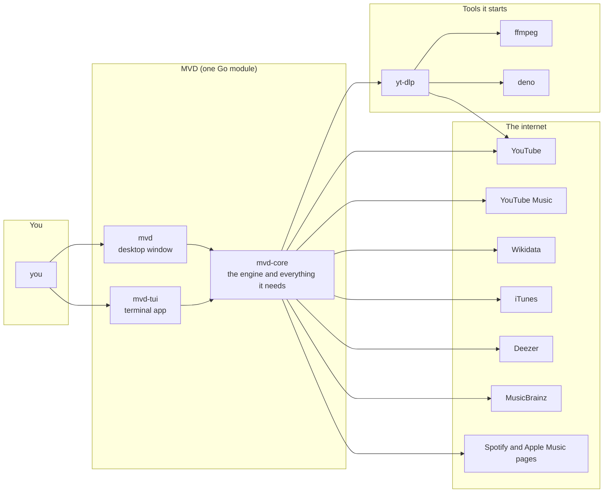

Two front ends share one core. Nothing in the core knows which one is on top of it.

---

## 2. The layers

There are four layers of code. A layer only calls the one below it, and the engine is the only place where concurrency lives.

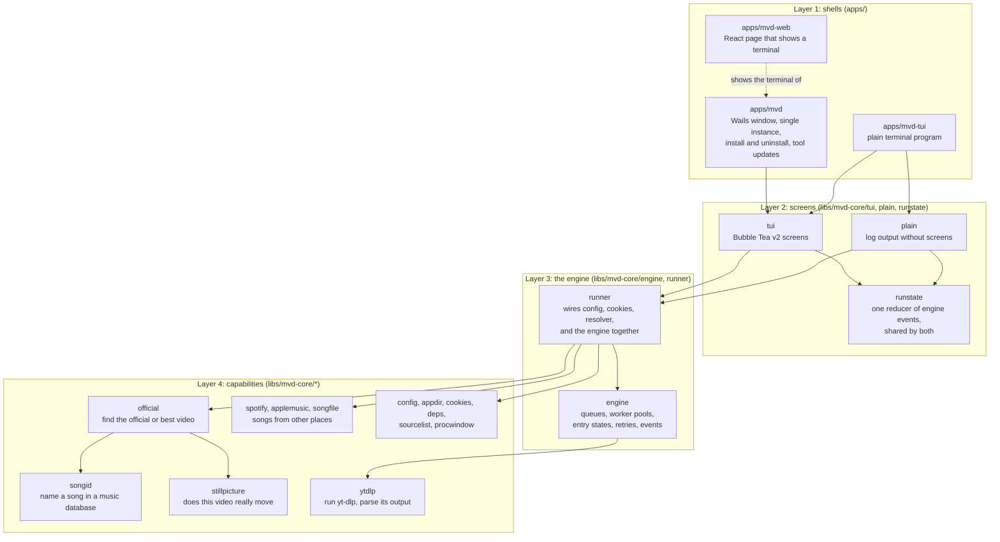

| Layer | Package | Responsibility | How |
|---|---|---|---|
| Shell | `apps/mvd` | A window, one instance, installation, tool updates | Wails v2 owns the window; `SingleInstanceLock` keeps one copy; `OnBeforeClose` asks before quitting during a download |
| Shell | `apps/mvd-tui` | The same app in a terminal | Starts the Bubble Tea program directly, or `--no-tui` for plain log lines |
| Shell | `apps/mvd-web` | A page that draws a terminal | React and xterm.js through `@treactui/tty`, served from the app's own embedded assets |
| Screens | `tui` | Every screen, key and mouse event | Bubble Tea v2 models; `View()` returns a `tea.View` with alt screen and mouse mode |
| Screens | `plain` | The log for `--no-tui` and the end summary | Reads the same events, prints lines |
| Screens | `runstate` | The truth the screens draw | Reduces engine events into one state (entries, totals, log tail) |
| Engine | `engine` | Running the work: stages, pools, states, retries | Four queues and worker pools; one event channel |
| Engine | `runner` | Putting it together | Resolves cookies, builds the resolver and the engine from `config.conf` |
| Capability | `official` | The best video for a song | Cache, Wikidata, YouTube Music, YouTube search, scoring; see [section 8](#8-stage-3-pick) |
| Capability | `songid` | Who sings it and what it is called | iTunes, Deezer, MusicBrainz, each paced; see [section 7](#7-stage-2-name) |
| Capability | `stillpicture` | Does the video really move | Storyboard frames, changed-area measure; see [section 9](#9-real-video-or-not-the-motion-check) |
| Capability | `ytdlp` | Everything that runs yt-dlp | Builds arguments, parses listings, progress lines, formats and storyboards |
| Capability | `spotify`, `applemusic`, `songfile` | Songs that are not YouTube links | Reads public pages without a login, or a text/CSV file |
| Capability | `config`, `appdir`, `cookies`, `deps`, `sourcelist` | Settings, folders, browser cookies, auto-installed tools, the list of links | Plain files in the app-data folder |

**Where the code lives is where its job is.** Files are named by role (`*_use_case.go`, `*_policy.go`, `*_client.go`, `*_algorithm.go`, `*_mapper.go`, `*_store.go`): a `policy` makes a decision with a business meaning, an `algorithm` is a pure computation, a `client` talks to something outside, a `store` holds state.

---

## 3. From keypress to pixels: the desktop transport

The window is a web page that draws a terminal. There is **no local server and no port**: the page and the Go program talk through Wails events.

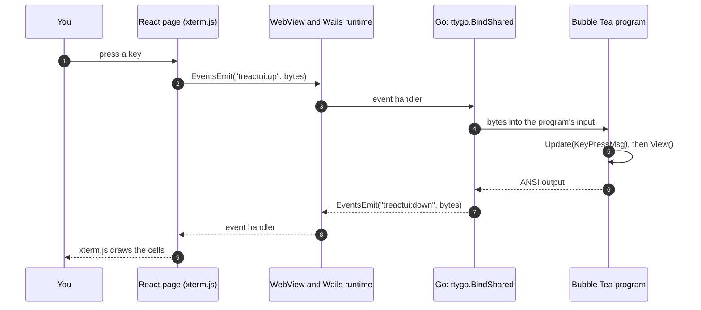

- The page is served by Wails' own `AssetServer` from files embedded in the binary (`appwindow/web`, staged from `apps/mvd-web/dist` at build time).
- `ttygo.NewSharedProgram` runs **one** program; whoever attaches (the window, or later another) sees the same screens.
- The program owns mouse mode and the alternate screen through `tea.View`, so the same screens work in a real terminal and in the window.
- Closing the window with downloads running asks first (`close_guard_policy.go`); a second launch finds the running copy and exits.

---

## 4. The engine and its four stages

This is the heart of the app. Every entry (one song of one playlist) goes through four stages, each with its **own queue and its own workers**, so a slow stage never idles the others.

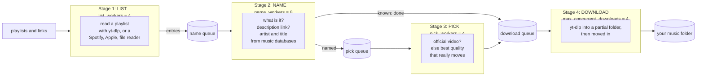

| Stage | Setting | Default | Does | Why this many |
|---|---|---|---|---|
| 1 List | `list_workers` | 4 | Reads each playlist into entries | Few people list more than a few at once; each is one yt-dlp run |
| 2 Name | `name_workers` | 8 | Classifies the upload, follows the description link, names the song | Cheap HTTP calls; each service is paced on its own, so more workers cannot hurt them |
| 3 Pick | `pick_workers` | 4 | Searches for the official video, else the best quality | Each step is a yt-dlp process; YouTube answers bursts with 429 and 403 |
| 4 Download | `max_concurrent_downloads` | 4 | Downloads and merges | The user's own limit, as before |

### How entries move

An entry enters at the name queue. The stage that handles it decides where it goes next:

| Entry | Name stage | Pick stage | Download stage |
|---|---|---|---|
| A song of another service (Spotify, Apple, file) | passes it on | `Tracks.Find` searches YouTube for it | downloads the found video |
| A YouTube upload the resolver is wanted for | identifies it; may already know the answer | official video, else best quality | downloads the chosen version |
| An upload that says it is the official video | passes it on (nothing to look up) | skipped | downloads it as it is |
| The resolver is off | passes it on | skipped | downloads it as it is |

### Why four queues and not one

Before this design, one worker did list, name, search and download of a song in turn, so while a download ran, no search for the next song did. Now the lookups run **ahead** of the downloads. On a 49-song playlist that took the whole run from 9 min 12 s to 7 min 1 s ([section 16](#16-measured-numbers)).

### Shutdown order

Stages are closed **front to back**, each one emptied before the next closes, so nothing is ever handed to a queue nobody reads.

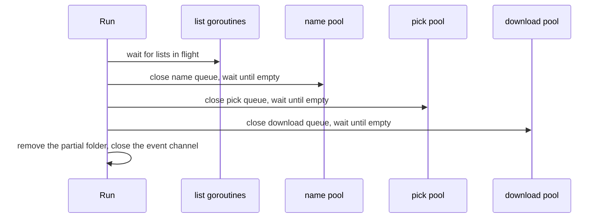

### Knowing when it is idle

`pending` counts entries in flight and `listsActive` counts playlists being read. The engine is idle when `pending == 0` and nothing is being or waiting to be listed. `AddSource` can add a playlist to a running engine; it marks the engine busy under the same lock the producer takes, so an "idle" can never slip in between.

---

## 5. One song, end to end

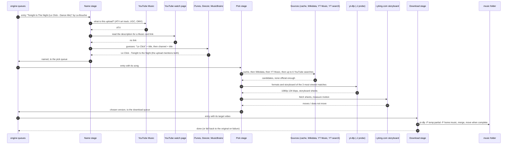

The same flow as a decision list:

1. Is it an art track? (YouTube Music's own tag `ATV`, or a `- Topic` channel, or "Provided to YouTube" in the description.)
2. If yes, does its description link the official video (the "Music" card)? Done, **official**.
3. Which song is it, really? Ask the databases with several readings of the title; accept only an answer the upload itself mentions.
4. Search for the official video under that name. Found with confidence? Done, **official**.
5. Otherwise, among the uploads that match the song, drop art tracks and videos that do not really move, and take the one with the best picture and sound, unless the playlist's own is as good. Done, **better quality**.
6. Nothing better? Download the playlist's own upload.

---

## 6. Stage 1, list

| Source | How it is read |
|---|---|
| A YouTube playlist or video | `yt-dlp --flat-playlist -j`, one JSON line per entry |
| A Spotify playlist | The public embed page's track list, no login |
| An Apple Music playlist | The data the playlist's web page ships with |
| A text or CSV file | `Artist - Title` lines, or a CSV with title and artist columns |

The three non-YouTube sources produce **tracks** (artist and title, no video yet). The engine keeps them next to the entries, and the pick stage finds their video.

Listing runs up to `list_workers` playlists at once. Each finished list gives the engine its entries (`EvPlaylistListed`) and pushes them to the name queue, so work for the first playlist starts while later ones are still being read.

---

## 7. Stage 2, name

The goal: from the **title and channel of an upload**, say which song it is and who sings it, in the words of a music database. Titles are untidy:

| Upload title | Channel | What is where |
|---|---|---|
| `Tonight Is The Night (Le Click - Dance Mix )` | La Bouche | the artist is in the brackets, and it is not the channel |
| `Masterboy - Pump It Up (Radio Edit) (1991)` | a re-upload channel | artist first, mix and year after |
| `Run to You` | `Rage - Topic` | the artist is the channel |
| `Pump Up The Volume MARRS` | any | the artist is written without slashes (`M/A/R/R/S`) |

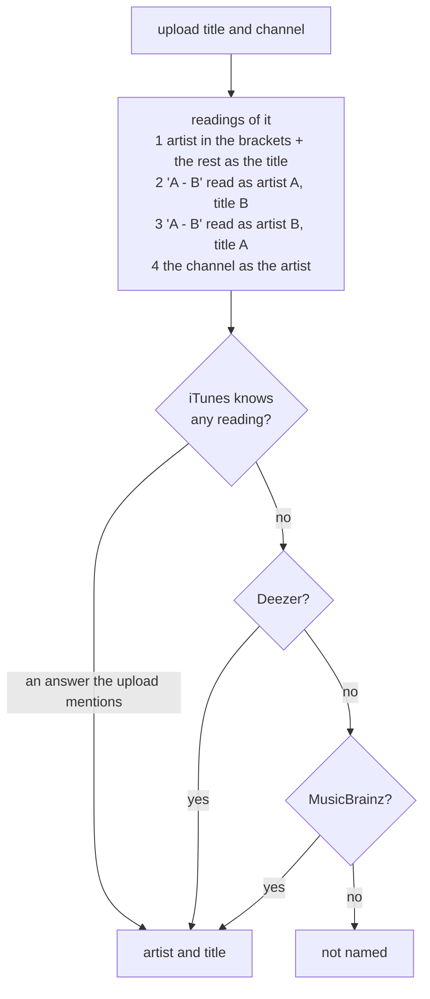

### What "an answer the upload mentions" means

A database may return a different song with a similar name. An answer is accepted only if **both** hold:

- the upload's title or channel **mentions the artist** as whole words, ignoring case, accents and punctuation (an initialism written together counts: `M/A/R/R/S` is in `MARRS`), and
- the upload's title **says the song**: title similarity of at least 0.6 after leaving out the artist's words, mix words, years and the bracketed parts.

Another artist's song of the same name is refused ("Run To You" by Bryan Adams for an upload by Rage).

### The cleaning of titles

A search is made with the **bare song**. A list of ignored terms (`mix`, `remix`, `edit`, `version`, `extended`, `radio`, `club`, `dance`, `dub`, `album`, `original`, `remastered`, years, and so on) is cut from three places: the brackets, the end of the title (`Pump It Up Radio Edit` is `Pump It Up`), and a dash tail made only of such words (`Finally - 7'' Mix 1991`). A `feat. X` credit is cut too. When cutting would leave nothing, the title is kept whole.

### Each service on its own pace

| Service | Spacing | Why | On refusal |
|---|---|---|---|
| iTunes Search | 300 ms | Apple's documentation mentions a per-minute limit; this is well inside what it tolerated in testing | 403, 429 or 503: left alone for a minute |
| Deezer | 120 ms | its documented limit is around 50 requests per 5 seconds | the same |
| MusicBrainz | 1.1 s | one request a second | the same |

The spacing is a **shared slot reservation**: however many workers ask, each one gets the next free slot. A service that refuses is skipped (its callers move on to the next database) and tried again after a minute.

### Why iTunes and Deezer go before MusicBrainz

They answer at once and have no tight limit; MusicBrainz is the most complete but allows one request a second. In a test of 49 songs, naming took 60 s with MusicBrainz first and 18 s with iTunes first, naming 43 and 42 songs.

---

## 8. Stage 3, pick

The goal: the video to download. Two questions in order: **is there an official one**, and if not, **which upload is best**.

### 8.1 Sources, cheapest and most exact first

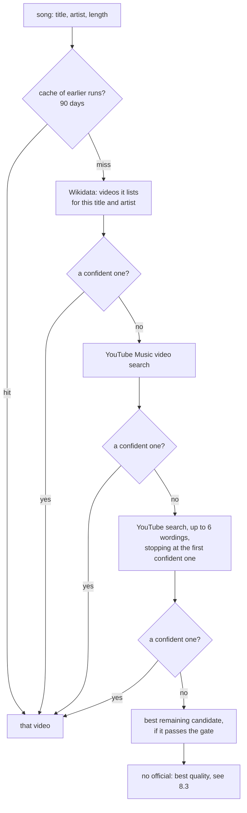

The six YouTube wordings, in order:

1. `<title> <artist> official video`
2. `<artist> <title> official music video`
3. `<artist> - <title>`
4. `<artist> <title> music video`
5. `<title> <artist>`
6. `<artist> <title as the playlist spelled it>` (only if it differs from the cleaned one: cleaning may have cut a real part, as in `(Everything I Do) I Do It for You`)

### 8.2 What makes a candidate official

A candidate is dropped before scoring if it is the upload itself, a `- Topic` channel, a cover, karaoke, live, reaction, instrumental, remix, interview, concert, TV take, re-edit and so on (unless the song itself is that), or its title is not the song (similarity under 0.6), or neither the title nor the channel mentions the artist, or a re-upload with under 50,000 views from a channel that is not the artist's.

Then, to be taken at all, it must **say it is official**, be uploaded by the **artist's own channel**, or be **listed by a database**. An audio or lyric upload is taken only from the artist's own channel.

| Evidence | Score |
|---|---|
| Title similarity (0 to 1) | x 4 |
| The artist's own channel | + 3 |
| Says "official" | + 2 |
| Verified channel | + 1 |
| Listed by a database (Wikidata, YouTube Music) | + 3 |
| YouTube Music tags it as an official video (`OMV`) | + 1.5 |
| Views | + up to 1 (log10 of the count / 8) |
| Same length as the song (within 5 %) | + 1.5 (+ 0.8 within 15 %, + 0.2 within 35 %, - 0.8 beyond) |

A score of **8.5** or more, from a candidate that says it is official or is listed, ends the search at once ("confident"). The top five candidates are checked with YouTube Music, and any that is itself an art track under the artist's own name is dropped: YouTube shows many art tracks under the artist's name, so a result from "the artist's channel" may be one.

### 8.3 No official video: the best quality

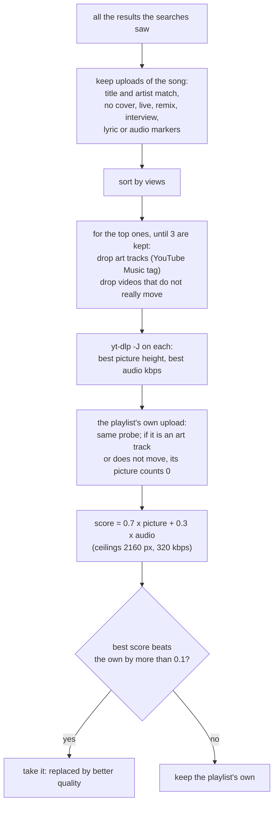

The 0.1 margin is there so a different file is only taken for a clear improvement. The picture counts more than the sound because it is what varies most between uploads.

### 8.4 Two calls, one lookup

The resolver exposes `Identify` (stage 2) and `Pick` (stage 3). `ResolveVersion` is both, in turn, for callers that do not need the stages apart; `ResolveLog` answers with official videos only, so that what the weekly check records does not change with every view count.

---

## 9. Real video or not: the motion check

An art track is a still image with a song. So is an "audio" upload with the cover, a visualizer, and many lyric videos. They download as video files, at 1080p, and are not a better version of the song. The check tells them from a video that moves.

### 9.1 Where the frames come from

YouTube keeps a **storyboard** of every video: one small frame every second or two, laid out in a few sheets (the preview you see when hovering the seek bar). It is already in the `yt-dlp -J` output fetched to measure quality, so the check costs a few small image downloads and no extra yt-dlp run.

If a video has no storyboard, the three frames YouTube makes of every video (at 25, 50 and 75 percent) are used instead.

### 9.2 What is measured

The method is borrowed from [scanmate](https://github.com/russoedu/scanmate)'s pixel comparison, which finds ink a scan added to a document. Pages are video frames here.

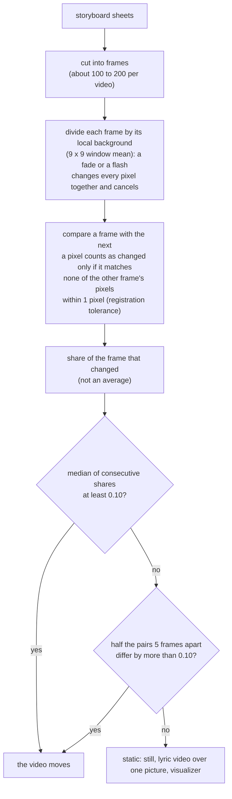

Scanmate's ideas, and what they became here:

| Scanmate (document scans) | Here (video frames) |
|---|---|
| Divide by the local background: a shadow or a grey lid takes no part | Divide by a 9 x 9 local mean: a fade, a flash or a vignette takes no part |
| Fatten the original's ink by a tolerance before subtracting: no halo of confetti | A pixel is forgiven 1 pixel of drift in every direction |
| Measure square millimetres of ink with a floor, not a share of a box | Measure the share of the frame that changed, not a mean brightness difference |
| Connected components and floors | Replaced by the median and the far-pair share, which is what separates a small caption from a whole scene |

**Why not a simple difference between frames?** An average hides a caption that changes over a still background (a lyric video) and flags a compressed still. The share of changed area, after normalising and forgiving drift, separates them.

### 9.3 What it measured on real uploads

Sample of 30 uploads:

| Kind | Median change between frames | Moves? |
|---|---|---|
| Art track (still) | 0.002 | no |
| Fan upload with a cover (still) | 0.016 | no |
| Lyric video over one picture | 0.001 to 0.054 | no |
| Official visualizer | 0.002 | no |
| Official audio with a slow animation | 0.084, with 57 % of far pairs above 0.10 | yes |
| Official video | 0.12 to 0.43 | yes |
| Live performance, TV take | 0.20 to 0.30 | yes |
| Lyric video over real footage | 0.16 to 0.21 | yes |

### 9.4 What it will get wrong

- A video with a single static camera and little movement can look static (the cost is mild: it is left out of the best-quality choice).
- A static video with a lot of animated text may look moving.
- When the frames cannot be read at all, **nothing is left out**: a failing image server never costs a good version.

---

## 10. Stage 4, download

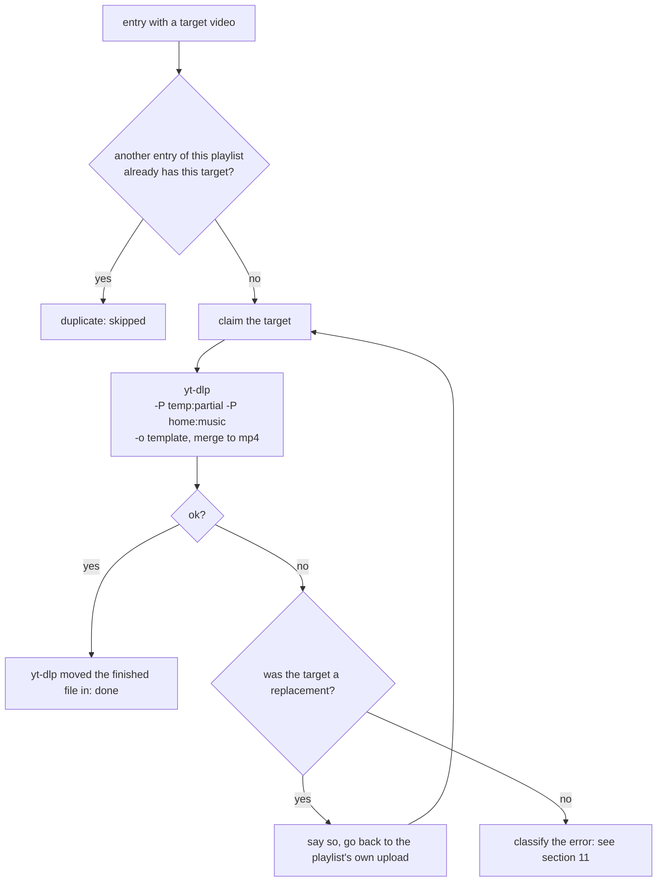

### The partial folder

yt-dlp keeps unfinished files (`.part`, `.f251.webm`, separate video and audio streams) in a **partial folder** in the app-data directory, and moves the finished file into your folder only once it is complete. A failed or cancelled download leaves nothing in your library. The folder is emptied when a run starts and removed when it ends.

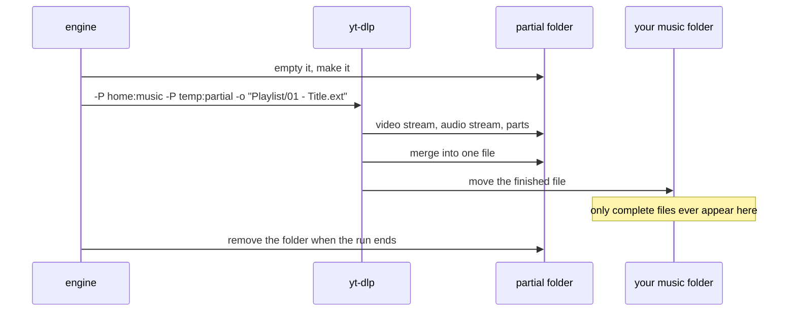

### Numbering and duplicates

The output template defaults to `%(playlist_title)s/%(playlist_index)02d - %(title)s.%(ext)s`. The playlist fields are filled by the engine from the listing (a single video has no playlist context for yt-dlp), and files are numbered by **playlist position**, so the order they finish in does not matter. Two entries that resolve to the same video are downloaded once; the second is a duplicate.

---

## 11. Failures and retries

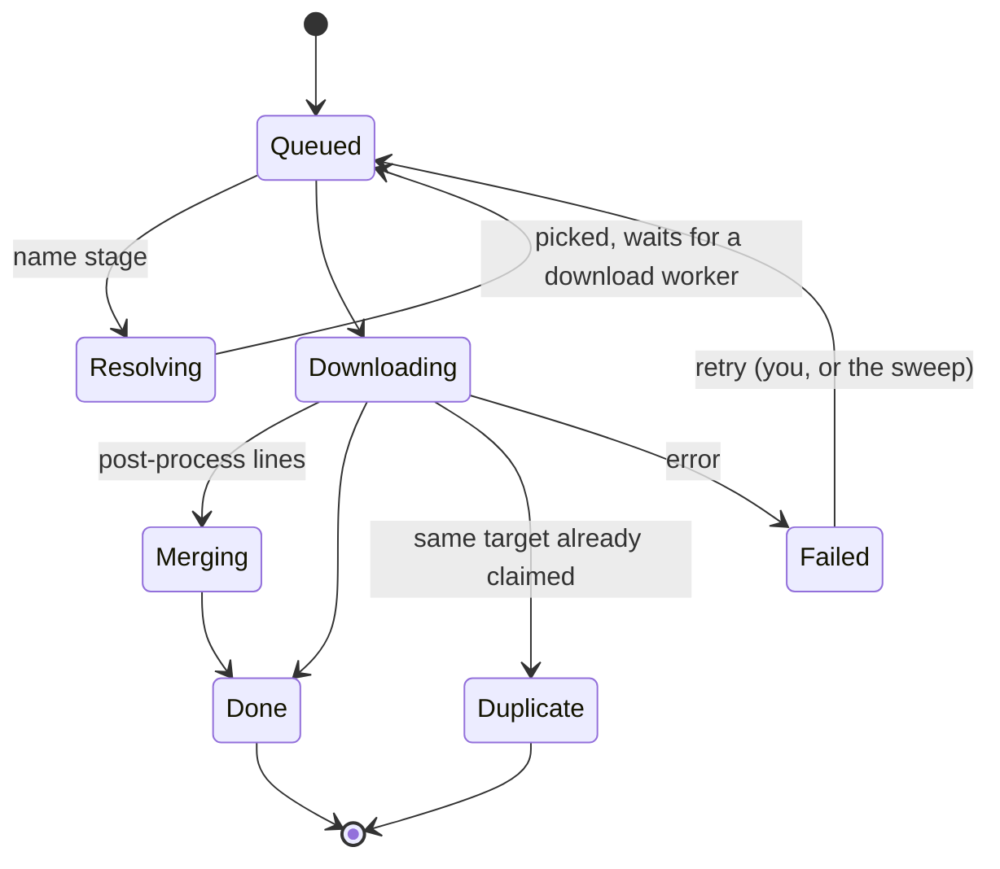

Errors are classified from yt-dlp's message (`retry_policy.go`):

| Class | Examples | What happens |
|---|---|---|
| Immediate | any error it does not recognise (a one-off glitch, "Unable to download webpage") | one retry at once |
| Deferred | `429`, "too many requests", `HTTP Error 403`, "sign in to confirm you're not a bot", timeouts, connection resets, network errors, 5xx | the entry fails now; after the backlog drains and a cooldown (20 s), a sweep retries it once |
| Permanent | private, removed or terminated, members-only, not available in your country, age-restricted, copyright | no retry |

Permanent signals are checked first, so an age gate ("sign in to confirm your age") is not mistaken for a bot check.

- **A replacement that fails falls back.** If the official or better-quality video cannot be downloaded (a 403 is common), the engine downloads the playlist's own upload instead, so an entry is not lost.
- **Auto-retry** can be turned off in the preferences; a failed entry can always be retried by hand.
- **A search that could not run** (a track of another service that could not be looked up) is marked deferred, since it is worth another try.

---

## 12. State, events and what the screen shows

The engine never draws anything. It sends **events** on one channel, and every front end reduces them into the same state.

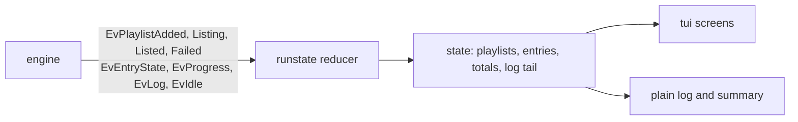

The totals the screens show:

| Counter | Meaning |
|---|---|
| Queue | entries waiting |
| Running | resolving, downloading or merging |
| Done | finished |
| Official | done, and replaced by the official video |
| Better | done, and replaced by a better quality upload |
| Dup | skipped duplicates |
| Failed | failed, and not (yet) retried |

---

## 13. Files and configuration

Everything the app keeps is in one app-data folder (`os.UserConfigDir()/mvd`).

| File | What |
|---|---|
| `config.conf` | Settings, `key=value`, written by the preferences screen |
| `list.txt` | The links and files in the list |
| `cookies.txt` | Browser cookies for YouTube, exported by yt-dlp |
| `official-videos.json` | The resolution cache, 90 days |
| `partial/` | Unfinished downloads, only while a run lasts |
| `mvd-downloads.log` | Every log line of a run |

Settings that shape the pipeline (the rest are in `NORMAL-README.md`):

| Key | Default | |
|---|---|---|
| `list_workers` | 4 | Playlists listed at once |
| `name_workers` | 8 | Uploads named at once |
| `pick_workers` | 4 | Versions picked at once |
| `max_concurrent_downloads` | 4 | Videos downloading at once |
| `concurrent_fragments` | 4 | Fragments of one video fetched in parallel |
| `download_official_music_video` | false | Turn the whole lookup on |
| `auto_retry` | true | Immediate retries and the sweep |

### Tools

On launch the app makes sure `yt-dlp`, `ffmpeg` and a JavaScript engine (`deno`) are present, downloading what is missing, and checks for newer yt-dlp builds. YouTube changes often, and yt-dlp is what keeps up.

### Cookies

YouTube answers bots with "Sign in to confirm you're not a bot" and 429. The app can use the cookies of a browser you are signed into: a pinned browser is exported again each run; in automatic mode it tries the installed browsers until one yields a usable session, and keeps the file.

---

## 14. How the weekly check keeps the app working against YouTube

Everything above depends on pages and endpoints YouTube can change without notice: the watch page and its description, the "Music" card, the innertube `next` endpoint, YouTube Music's `next` endpoint and its video-type tags (`ATV`, `OMV`, `UGC`), the shape of yt-dlp's search output, and the Wikidata queries. When one changes, the lookup silently stops finding official videos and the app just downloads the art tracks. Nobody notices for weeks.

So a GitHub Action **tests the real connections every week**, with the app's own code, and says so when something broke.

### What it is

| | |
|---|---|
| Workflow | `.github/workflows/youtube-check.yml` |
| Runs | Mondays at 06:17 UTC, and on demand (`workflow_dispatch`) |
| The probe | `tools/youtube-check`, a small Go program that uses `runner.BuildResolver`, the same function the app builds its resolver with |
| The playlist | A playlist kept for the purpose, with 50 songs or more, named by the repository variable `YT_CHECK_PLAYLIST` |
| The reference | `tools/youtube-check/baseline.json`: for every song of that playlist, the official video the lookup found when the baseline was recorded |

### What happens

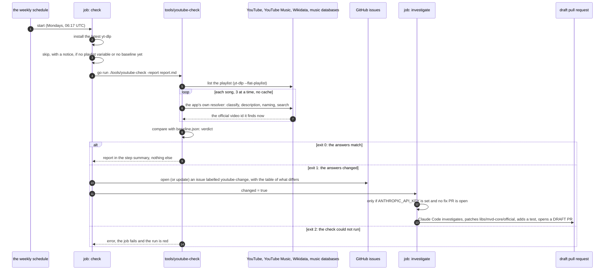

### The three exit codes

| Exit | Meaning | Job result |
|---|---|---|
| 0 | The answers match the baseline within the allowed share | green |
| 1 | The answers changed | green, an issue is opened, the investigation may start |
| 2 | The check itself could not run (no yt-dlp, an unreadable playlist, a bad baseline) | red |

### How the verdict is decided

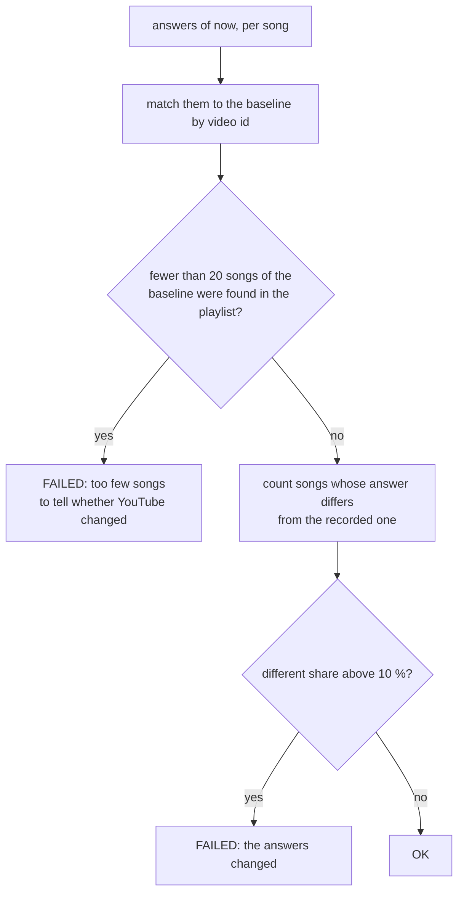

- A song **differs** when the video it found now is not the one recorded (including found-before and not-found-now, or the other way round).
- Songs in the playlist but not in the baseline are reported as **new**; songs recorded but no longer in the playlist as **gone**. Neither fails the check by itself.
- The 10 % allowance is there because the lookup is not perfectly stable: an official video can be re-uploaded, a database edited, a search ranked differently.
- No cache is used on purpose: an answer remembered from an earlier run would hide what YouTube does now.
- Quality probing is switched off in the check (`SkipQuality`): it only chooses among uploads when none is official, and the pick changes with every view count.

### What it covers, and what it cannot

| It does catch | It does not catch |
|---|---|
| The description page or Music card changing shape | Problems of downloading itself (a yt-dlp bug, a 403 on one machine): those are yt-dlp's |
| The innertube or YouTube Music endpoints changing, or their video-type tags | Bot checks that only hit a user's IP or account |
| yt-dlp's search output changing | A changed look of the app |
| Wikidata or a music database changing its answers | |
| A runner IP being sent a consent or bot page (it shows as a mass failure) | |

### The investigation job

Only when the answers changed, the secret `ANTHROPIC_API_KEY` is set, and no pull request from `fix/youtube-change*` is open, `anthropics/claude-code-action` runs with strict rules:

- find out **which** of the likely causes it is (YouTube changed a page or endpoint, a new yt-dlp, a blocked or consent-paged runner);
- make the **smallest** change in `libs/mvd-core/official`, add a test that fails without it, run `go test ./libs/...`;
- open a **draft** pull request on a branch named `fix/youtube-change-<date>` with a `fix:` commit;
- never merge, never push to `main`, never touch `.github`, the release configuration or any secret; if there is no fix (a block, an outage), comment on the issue instead.

A person reviews the draft and merges it. Merging a `fix:` releases a new version, and users get it.

### Setup (once)

1. Create the playlist (50 songs or more, public or unlisted) and set the repository variable `YT_CHECK_PLAYLIST` to its address.
2. Record the baseline: `go run ./tools/youtube-check -playlist <url> -record`, read it, commit `tools/youtube-check/baseline.json`.
3. Optional: add the `ANTHROPIC_API_KEY` secret and allow Actions to create pull requests (Settings, Actions, General).
4. Run the workflow once by hand: GitHub runners' IPs may be sent a consent or bot page by YouTube, and only a manual run shows that.

Until steps 1 and 2 are done, the check prints a notice and does nothing.

---

## 15. Build, release and CI

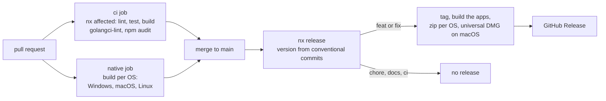

- **Commit types decide the release.** A `feat:` or `fix:` that touches a project (`apps/*`, `libs/*`) cuts a new `mvd` and `mvd-tui`; `chore:`, `docs:` and `ci:` never do.
- **CI runs the same checks the developer does**: `golangci-lint` (errcheck, staticcheck and the rest), the tests, `npm audit` (blocks on critical and high).
- **The build is native per OS** because the desktop app needs the system web view and CGO on macOS and Linux.
- **Commit messages are linted** by a hook: conventional types only, a header of at most 100 characters.

---

## 16. Measured numbers

All on one 49-song playlist of 90s dance songs, the same machine, the same day.

### Whole run

| Engine | Naming order | Time |
|---|---|---|
| Sequential (one worker did everything for a song) | MusicBrainz first | 10 min 50 s |
| Sequential | iTunes first | 9 min 12 s |
| **Pipeline, four stages** | iTunes, Deezer, MusicBrainz | **7 min 1 s** |

### Naming step alone, 49 songs

| Order | Time | Named |
|---|---|---|
| MusicBrainz first | 60 s | 43 |
| iTunes first | 18 s | 42 |

### Outcome of the pipeline run

| Result | Songs |
|---|---|
| Replaced by the official video | 34 |
| Replaced by a better quality upload | 5 |
| Skipped as duplicates | 1 |
| Failed | 0 |
| Files left in the library besides the videos | 0 |

For comparison, before the official lookup knew how to name songs, 19 of the 49 were replaced by an official video.

### The motion check

| Kind of video | Median share of the frame that changes between frames |
|---|---|
| Still picture (art track, cover) | 0.0 to 0.02 |
| Lyric video over one picture | 0.0 to 0.06 |
| Real video | 0.12 to 0.43 |

---

## 17. Decisions worth knowing

| Decision | Why |
|---|---|
| **No local server in the desktop app** | A port can collide, can be scanned, and needs an origin check. Wails events need none of that. |
| **Stages with their own queues, not one pool** | A stage's limit is the service it talks to (a rate limit, a process, a bandwidth), and those differ. One number would be wrong for three of the four. |
| **A pacer per service, not a global limit** | MusicBrainz asks for one request a second; iTunes and Deezer do not. A slot reservation keeps every worker polite without serialising them. |
| **A service that refuses is left alone, not retried** | The answer is only a help; the next database or the plain search carries on. |
| **Only an official video ends the search early** | A video from the artist's channel that says nothing may be a TV performance next to the real video. |
| **The best quality is chosen by picture first** | The picture is what varies most between uploads. |
| **A still counts as no picture, even at 1080p** | An art track's file is 1080p of a single image. |
| **A static check that cannot read frames leaves nothing out** | A failing image server must not cost a good version. |
| **`ResolveLog` answers with official videos only** | The weekly check must not alert on view counts. |
| **The weekly check does not use the cache** | A remembered answer would hide a change in YouTube. |
| **Download into a partial folder** | The library only ever holds complete files. The price is that an interrupted download is not resumed by a later run. |
| **Merge when it is green** | Every request is an issue, every issue a branch, every branch a pull request that CI must pass; merging is the last step, not a ceremony. |
